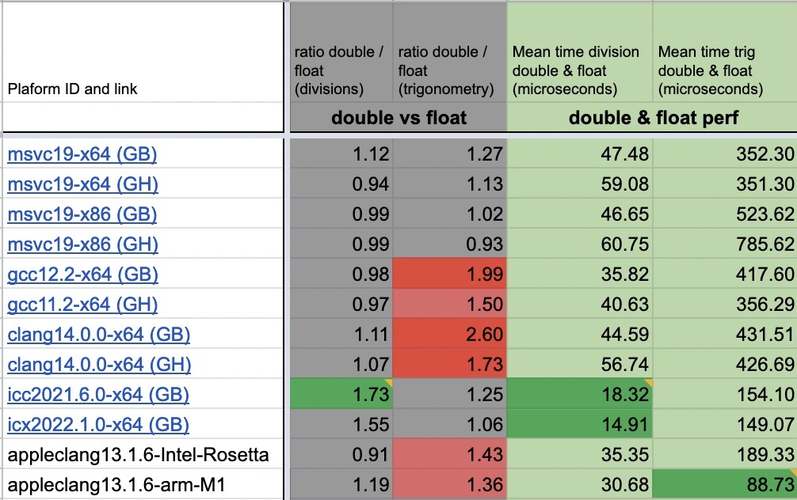
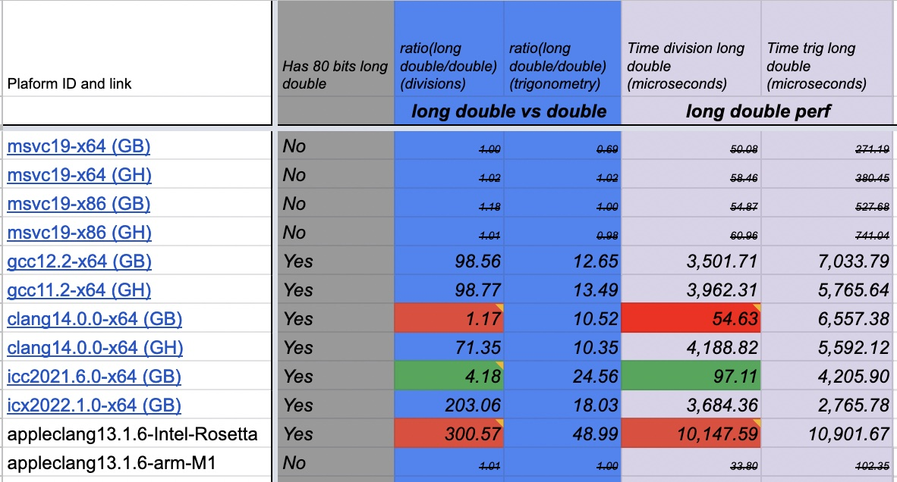

# A compared review of float types performances

This document shows a comparison of the different C/C++ float types performances on several platforms. Two distinct scenarios are compared: "divisions" (as well as arithmetic) operations, and "trigonometry" operations.

Benchmarks were run on MacOS/Linux/Windows, using clang/gcc/msvc/apple-clang/icc and icx (Intel compilers), with 32 bits, 64 bits and ARM configurations. These benchmarks are CPU only (no GPU was used).

The tested types are: 

* `float` (32 bits float)
*  `double` (64 bits float) 1
*  `long double` : on Linux and Intel Macs, they are higher precision, i.e. 80 bits, stored on 16 bytes on 64bits architectures (and 12 bytes on 32bits arch). On Windows and Mac M1 Arm, "long double" is a synonym of "double"

_Note: these numbers should be taken as the result of simple and perhaps naïve tests. They do not give an accurate comparison of performance between compilers or between platforms, as they were executed on different Virtual Machines (either using Compiler Explorer, or Github actions). In this document we compare the performance of different types on a __same__ platform._

## Results 

### float versus double

The columns "ratio double / float" shows how slower `double` (64 bits) are when compared to `float` (32 bits) on two types of benchmarks: `divisions` + simple arithmetic operations, and `trigonometric` operations. 

_Notes: Times are in microseconds, but they account for a loop where 30000 of those operations were processed (mixed with multiplications and additions). `(GH)` means that the benchmark was run as part of a Github Action workflow, and `(GB)` means that it was run on Compiler Explorer. You can run for yourself the benchmarks in Compiler Explorer: see [link to google sheet](https://github.com/pthom/float_performance/blob/main/Readme.md#full-results) below._




A few observations:
- trigonometric operations seems to be faster with msvc, when compared to clang and gcc (using libstdc++).
- float and double often have comparable performances for division
- However, Intel Compilers (icc and icx) seem to have excellent arithmetic performance, and generate even faster code for `float` when compared to `double`. It is likely that they emitted SIMD instructions.


### long double compared performance

`long double` are more rarely used. On several platforms they are _quasi-synonyms_ of "double" (i.e. they have the same size, but are nonetheless considered a separate type by the compiler). On Linux and MacOS Intel, they actually use 80 bits, stored on 4 bytes (on 64 bits platforms).

The columns "ratio long double / double float" shows how slower `long double` (80 bits) are when compared to `double` (64 bits) on both of the benchmarks.


A few observations:

- Measures where `long double` is a quasi-synonym of `double` are ~~strikethrough ed~~
- `long double` can be 100 times slower on divisions! There are notable exceptions: icc gives a ratio of 4.17
- clang14.0.0-x64 (GB) gives inconsistent results! Sometimes we see a ratio of 1.07 (almost too good to be true), and on sometimes it is closer to 100! [See for yourself](https://godbolt.org/z/88fTTGGP6)
- On mac M1, `long double`  is a synonym of `double`. However when Rosetta is enabled, `long double` use 80 bits on 4 bytes. And the performance drops.

## Full results

The images shown in this document are extracted from a [dedicated google sheet](https://docs.google.com/spreadsheets/d/1Fyq9QXU8ZopL7pR1BlNTsyT6X5hftS9dfVyhdVHVEKE/edit#gid=1116748036) : look at the "Analysis" and "data" tab.

For each configuration, this sheet provides clickable links to Compiler Explorer or to Github Workflow logs  (which were run in this repository). The abbreviation "(GH)" means that the benchmark with run with GitHub worflow, and "(GB)" means that it was run on Compiler Explorer (Godbolt).


## Benchmarked code

Below are the functions which were benchmarked, using [nanobench](https://nanobench.ankerl.com/)

````cpp
#define NB_FLOAT_LOOPS 30000

template<typename T>
void exercise_division()
{
    T seed = (T)gRandomGenerator.uniform01();
    T r = (T)0.;
    for (int i = 0; i < NB_FLOAT_LOOPS; ++ i)
    {
        T x = (T)i;
        r = r + (x - 1. + seed ) / (x - 2.);
    }
        
    ankerl::nanobench::doNotOptimizeAway(r);
}

template<typename T>
void exercise_trigonometry()
{
    T seed = (T)gRandomGenerator.uniform01();

    T r = (T)0;
    for (int i = 0; i < NB_FLOAT_LOOPS; ++ i)
    {
        T x = (T)i;
        r = r + cos(x * seed);
    }        
    ankerl::nanobench::doNotOptimizeAway(r);
}
````

The full benchmark code is available in this repository: see [perf.cpp](perf.cpp).
